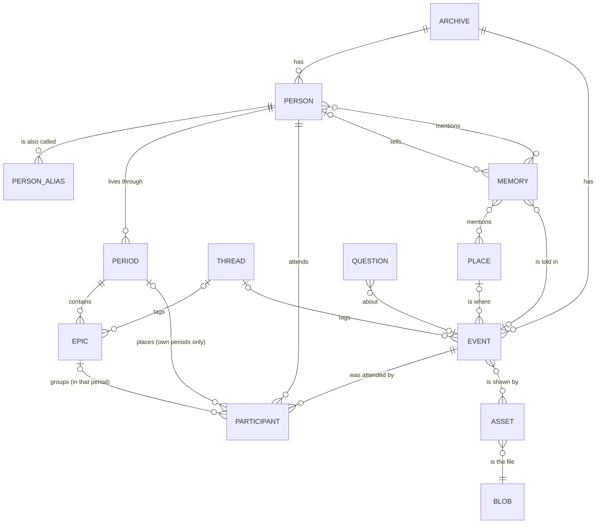

# Data model

The entities, how they connect, and what happens when one is deleted. Requirements section 3 is the spec; this page
follows the migrations (`api/app/migrations/versions/`) and is changed with them.

## The picture

## The entities

| Entity | Table | What it is |
|---|---|---|
| Archive | `archives`, `archive_settings` | One family's memoir, and the settings the owner may change (requirements 3.4) |
| User | `users` | A login (see `ACCOUNTS.md`) |
| Person | `people`, `person_aliases` | Someone in the family's life, with or without a login. Name unique in the archive, case-insensitive. Aliases are unique per person; one alias may name several people ("the kids"); an alias cannot be someone else's name. At most one person per login |
| Place | `places` | A named location, unique per archive, with optional coordinates |
| Thread | `threads` | A theme across time. Title and slug unique per archive. Tags epics and events, never periods |
| Period | `periods` | A chapter of **one person's** life. Slug unique per person |
| Epic | `epics` | An arc inside one period. Weight 1 to 10 |
| Event | `events` | A moment. It has no period of its own: each participant places it. Weight 1 to 10 |
| Participant | `participants` | A person at an event: role (`participant`, `storyteller`, `mentioned`, `in_photo`), source (`confirmed`, `transcript`, `face`), whether a person confirmed it, and **their** period and epic for the event |
| Memory | `memories`, `memory_mentions`, `memory_places` | A told story: storyteller, uploader, transcript, date, tone, visibility, the people and places it names. Belongs to one event once placed |
| Asset | `assets`, `event_assets` | A file (photo, document, audio) and its record. Linked to any number of events as `evidence` or `recording` |
| Question | `questions` | A follow-up prompt. Pending questions are unique by their text without case or extra spaces |

Every domain table carries `archive_id`, `created_at`, `created_by`, `updated_by`, `updated_at` and `deleted_at`.

## Placement: one event, many lives

An event appears on the timeline of every participant. Each participant places it in one of **their own** periods,
and optionally in an epic of that period; the epic decides the period. The wedding sits in "Our marriage" on one
line and "Navy years" on the other, as one row. The database checks both rules with composite foreign keys
(`(period_id, person_id)` to `periods`, `(epic_id, period_id)` to `epics`), at commit, so a move or a merge can
change both sides in one transaction. An event nobody has placed is in the inbox.

When a memory is placed on an event, its storyteller and everyone it mentions become participants, marked
`transcript` and unconfirmed until a person confirms them.

## Visibility

A memory is `archive` (everyone in the archive) or `only_me`: seen only by the login that uploaded it and the
storyteller's own login. Every query that returns memories applies this rule (`memories.visible_to`).

## Deleting

Deleting from the app is **soft**: the row gets `deleted_at` and disappears from every list; the trash keeps it for
30 days. What a soft delete does to related rows:

| Deleted | What happens |
|---|---|
| Person | Their periods and those periods' epics are deleted with them. Events they took part in stay on everyone else's timeline. Their own placements stay attached to them |
| Period | With epics or placed events inside, the app must choose: **move** everything to another of the same person's periods, or **unassign** (the epics go with the period, their events lose their placement and go to the inbox). An empty period is just deleted |
| Epic | Its events stay in the period, no longer grouped |
| Event | Its memories and photos are kept and show in the inbox |
| Thread | Epics and events are untagged |
| Place, memory, asset, question | Hidden; what named or linked them keeps its own text |

**Purging** removes rows for good: the nightly `domain.purge` job takes what was deleted more than 30 days ago, and
the owner can purge now (`POST /api/trash/purge`). Before an epic or a period goes, the purge takes every placement
off it. Then the database's own rules apply:

| Removed for good | Rule in the database |
|---|---|
| A blob still used by an asset | Refused |
| Person | Aliases, periods (and their epics), participations and mentions go too; memories they told keep the memory with no storyteller; questions about them lose the link |
| Period | Its epics go too; refused while a placement still points at it |
| Epic | Refused while a placement still points at it |
| Event | Its participants and asset links go too; its memories and questions lose the link |
| Thread | Epics and events lose the tag |
| Place | Events and assets lose it; memory mentions of it go |
| Memory | Its mentions go; questions it raised or answered lose the link |
| Asset | Its event links go |
| Login | People and rows it made or changed lose the link |
| Archive | Everything in it goes |

`api/tests/test_delete_rules.py` checks each line of this table against the database.

## Merging

| Merge | What moves | What is filled |
|---|---|---|
| Event into event | Memories, asset links (once each), participants (one per person: the target keeps theirs and takes the source's placement if it had none), questions | Every empty field of the target from the source |
| Person into person | Periods (slugs made unique), placements, memories told, mentions (once each), questions, aliases; the source's name becomes an alias; the login, if only the source had one. Two people with their own logins do not merge | Empty contact and date fields |
| Period into period | Epics and placements. Only within one person's life | Empty dates and summary |

The source is soft-deleted in every case.

## Lists

Every list endpoint returns `{"items": [...], "next_cursor": "..."}`, 50 items by default (`limit` up to 200).
Pass `cursor` to get the next page. Lists are ordered by name, or by date with undated rows last.

## Dates

Dated rows keep the text as typed (`date_text`, `start_text`, `capture_text`, `birth_text`) and its parsed range
and precision (`*_start`, `*_end`, `*_precision`; on periods and epics `start_on` and `end_on`). The date grammar
(ticket #4) fills the parsed columns.
